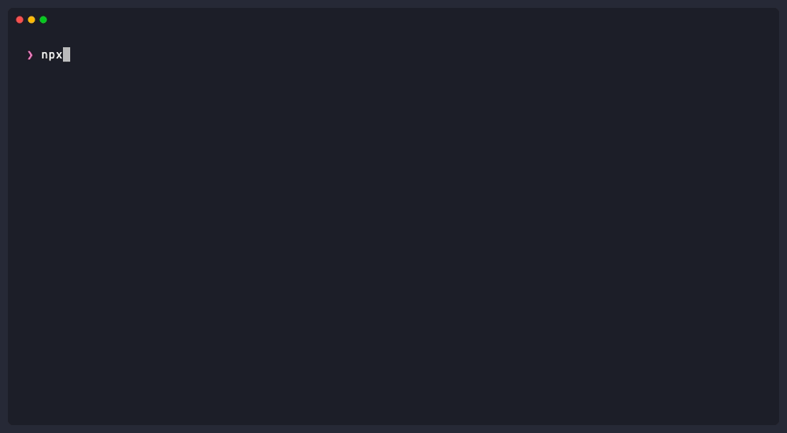

# UIKit Expert Skill

An AI Agent Skill for writing correct, performant, and modern UIKit code in Swift. Designed to work with Claude, Cursor, Windsurf, Copilot, and other AI coding assistants that support the Agent Skills / AGENTS.md format.

<p align="center">
  
</p>

## Philosophy

This skill focuses on **facts and best practices**, not architectural opinions:

**Covered:**

- Correctness — lifecycle ordering, retain cycle prevention, thread safety
- Performance — constraint churn avoidance, scroll optimization, image downsampling
- Modern APIs — diffable data sources, compositional layout, cell configuration, Observation

**Intentionally excluded:**

- No architecture mandates — no MVVM/VIPER/Coordinator enforcement
- No formatting rules — no property ordering or file structure requirements

## Structure

```
uikit-expert-skill/
├── .claude-plugin/
│   ├── plugin.json                             # Claude Code plugin manifest
│   └── marketplace.json                        # Claude Code marketplace catalog
├── AGENTS.md                                   # Meta-rules for AI agents
└── uikit-expert/
    ├── SKILL.md                                # Decision tree router (entry point)
    └── references/
        ├── view-controller-lifecycle.md        # Lifecycle ordering, viewIsAppearing
        ├── auto-layout.md                      # Batch activation, constraint churn, animation
        ├── modern-collection-views.md          # Diffable, compositional, CellRegistration
        ├── cell-configuration.md               # UIContentConfiguration, configurationUpdateHandler
        ├── list-performance.md                 # Prefetching, cell reuse, scroll performance
        ├── navigation-patterns.md              # Bar appearance, concurrent transitions, deep links
        ├── animation-patterns.md               # UIView.animate, PropertyAnimator, CAAnimation
        ├── memory-management.md                # Retain cycles, [weak self], delegate ownership
        ├── concurrency-main-thread.md          # @MainActor, Task lifecycle, Swift 6
        ├── uikit-swiftui-interop.md            # UIHostingController, UIViewRepresentable
        ├── image-loading.md                    # Downsampling, decoded bitmap math, cell race condition
        ├── keyboard-scroll.md                  # UIKeyboardLayoutGuide, scroll insets
        ├── adaptive-appearance.md              # Traits, Dynamic Type, dark mode, VoiceOver
        └── modern-uikit-apis.md                # Observation, updateProperties(), .flushUpdates, UIScene
```

## How It Works

**SKILL.md** acts as a decision tree router. Based on user intent (review / improve / implement), it directs the AI agent to the relevant reference documents. Each reference document is self-contained with:

- Concrete correct and incorrect Swift code examples
- "Why" explanations for each recommendation
- Summary checklists at the bottom

## Coverage

| Domain             | Key Topics                                                                                       |
| ------------------ | ------------------------------------------------------------------------------------------------ |
| Lifecycle          | `viewIsAppearing` (iOS 13+), child VC containment, deallocation verification                     |
| Auto Layout        | Batch activation, zero-churn patterns, constraint animation, `.flushUpdates` (iOS 26)            |
| Collection Views   | Diffable data sources, stable identity, compositional layout, list configuration                 |
| Cell Configuration | `UIContentConfiguration`, `UIBackgroundConfiguration`, `configurationUpdateHandler`              |
| List Performance   | Prefetching with Swift concurrency, cell reuse race condition, `reconfigureItems`                |
| Navigation         | 4-slot `UINavigationBarAppearance`, concurrent transition guards, iOS 26 Liquid Glass            |
| Animation          | API selection guide, `UIViewPropertyAnimator` state machine, spring animations                   |
| Memory             | 4 retain cycle traps (Timer, NotificationCenter, CADisplayLink, nested closures), Task retention |
| Concurrency        | `@MainActor`, Task lifecycle, Swift 6 migration, `Task.detached` pitfalls                        |
| Interop            | `UIHostingController` containment, `sizingOptions`, `UIViewRepresentable` lifecycle              |
| Images             | ImageIO downsampling, decoded bitmap math, cancel/clear/verify pattern                           |
| Keyboard           | `UIKeyboardLayoutGuide`, iPad floating keyboard, scroll view sync                                |
| Adaptive           | `registerForTraitChanges`, Dynamic Type, CGColor dark mode trap, VoiceOver                       |
| Modern APIs        | Observation framework, `updateProperties()`, `.flushUpdates`, UIScene mandatory                  |

## iOS Version Coverage

- **iOS 13+**: `viewIsAppearing` (back-deployed), `UINavigationBarAppearance`
- **iOS 14+**: `UIContentConfiguration`, `CellRegistration`, compositional layout list configuration
- **iOS 15+**: `UIKeyboardLayoutGuide`, `reconfigureItems`, `scrollEdgeAppearance` changes
- **iOS 17+**: `registerForTraitChanges`, custom traits, spring animation API
- **iOS 18+**: `UIObservationTrackingEnabled` (opt-in), automatic trait tracking
- **iOS 26+**: `updateProperties()`, `.flushUpdates`, UIScene mandatory, Liquid Glass

## How to Use This Skill

### Option A: Using skills.sh (recommended)

Install this skill with a single command:

```bash
npx skills add https://github.com/ivan-magda/uikit-expert-skill --skill uikit-expert
```

For more information, [visit the skills.sh platform page](https://skills.sh/ivan-magda/uikit-expert-skill/uikit-expert).

Then use the skill in your AI agent, for example:

> Use the uikit expert skill and review the current UIKit code for lifecycle, memory management, and performance improvements

### Option B: Claude Code Plugin

#### Personal Usage

To install this Skill for your personal use in Claude Code:

Add the marketplace:

```bash
/plugin marketplace add ivan-magda/uikit-expert-skill
```

Install the Skill:

```bash
/plugin install uikit-expert@uikit-expert-skill
```

#### Project Configuration

To automatically provide this Skill to everyone working in a repository, configure the repository's `.claude/settings.json`:

```json
{
  "enabledPlugins": {
    "uikit-expert@uikit-expert-skill": true
  },
  "extraKnownMarketplaces": {
    "uikit-expert-skill": {
      "source": {
        "source": "github",
        "repo": "ivan-magda/uikit-expert-skill"
      }
    }
  }
}
```

When team members open the project, Claude Code will prompt them to install the Skill.

### Option C: Manual install

1. **Clone** this repository.
2. **Install or symlink** the skill folder following your tool's official skills installation docs (see links below).
3. **Use your AI tool** as usual and ask it to use the "uikit-expert" skill for UIKit tasks.

#### Where to Save Skills

Follow your tool's official documentation, here are a few popular ones:

- **Codex:** [Where to save skills](https://developers.openai.com/codex/skills/#where-to-save-skills)
- **Claude:** [Using Skills](https://platform.claude.com/docs/en/agents-and-tools/agent-skills/overview#using-skills)
- **Cursor:** [Enabling Skills](https://cursor.com/docs/context/skills#enabling-skills)

**How to verify**:

Your agent should reference the workflow/checklists in `SKILL.md` and jump into the relevant reference file for your task.

## License

MIT
