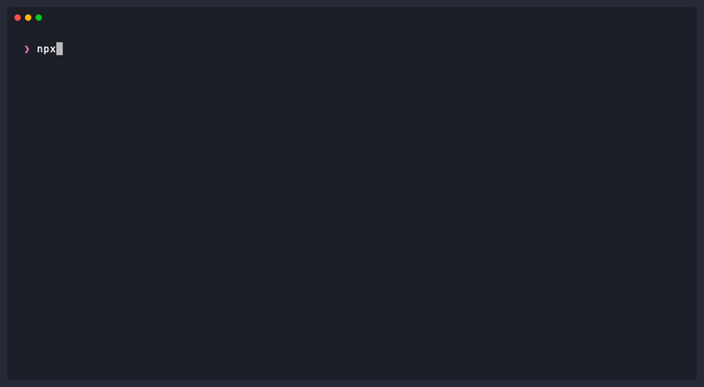

# UIKit Expert Skill

An AI agent skill for writing correct, performant, modern UIKit code in Swift.



## Table of Contents

- [Background](#background)
- [Philosophy](#philosophy)
- [Features](#features)
- [Installation](#installation)
- [Usage](#usage)
- [Project Structure](#project-structure)
- [Contributing](#contributing)
- [License](#license)

## Background

AI coding assistants tend to produce UIKit code with the same recurring mistakes: geometry work in `viewDidLoad` instead of `viewIsAppearing`, missing `[weak self]` in escaping closures, deprecated `cell.textLabel` instead of `UIContentConfiguration`, and navigation bar appearance set on the wrong object. This skill gives an agent the facts it needs to catch and fix those mistakes.

It ships in the Agent Skills format, so it works with any assistant that reads `SKILL.md` or `AGENTS.md`, including Claude Code, Cursor, Windsurf, and Codex. The entry point, `SKILL.md`, routes the agent through a decision tree (review, improve, or implement) and points it at the matching reference file for the task at hand.

## Philosophy

The skill teaches facts and best practices, not architecture. It draws a hard line:

- It uses "always" or "never" only for correctness, like setting `translatesAutoresizingMaskIntoConstraints = false` on programmatic views.
- It uses "consider" or "suggest" for optimizations, like image downsampling or list prefetching.
- It enforces no architecture. No MVVM, VIPER, or Coordinator mandate.
- It dictates no formatting. No property ordering, file structure, or naming rules.
- It optimizes for correctness first, then performance, following Apple's documented APIs and Human Interface Guidelines.

## Features

Fourteen reference files cover the surface area an agent hits when working with UIKit:

| Domain | Key topics |
| --- | --- |
| Lifecycle | `viewIsAppearing` (iOS 13+), child VC containment, deallocation verification |
| Auto Layout | Batch activation, zero-churn constraints, constraint animation, `.flushUpdates` (iOS 26) |
| Collection views | Diffable data sources, stable identity, compositional layout, list configuration |
| Cell configuration | `UIContentConfiguration`, `UIBackgroundConfiguration`, `configurationUpdateHandler` |
| List performance | Prefetching with Swift concurrency, cell reuse race condition, `reconfigureItems` |
| Navigation | Four-slot `UINavigationBarAppearance`, concurrent transition guards, Liquid Glass |
| Animation | API selection, `UIViewPropertyAnimator` state machine, spring animations |
| Memory | Retain cycle traps (Timer, NotificationCenter, CADisplayLink, nested closures), Task retention |
| Concurrency | `@MainActor`, Task lifecycle, Swift 6 migration, `Task.detached` pitfalls |
| Interop | `UIHostingController` containment, `sizingOptions`, `UIViewRepresentable` lifecycle |
| Images | ImageIO downsampling, decoded bitmap math, cancel/clear/verify pattern |
| Keyboard | `UIKeyboardLayoutGuide`, iPad floating keyboard, scroll view sync |
| Adaptive | `registerForTraitChanges`, Dynamic Type, CGColor dark mode trap, VoiceOver |
| Modern APIs | Observation framework, `updateProperties()`, `.flushUpdates`, mandatory UIScene |

Each reference is self-contained, with correct and incorrect Swift examples, a "why" for every recommendation, and a checklist at the bottom.

The guidance spans iOS 13 through 26:

- **iOS 13+**: `viewIsAppearing` (back-deployed), `UINavigationBarAppearance`
- **iOS 14+**: `UIContentConfiguration`, `CellRegistration`, compositional layout list configuration
- **iOS 15+**: `UIKeyboardLayoutGuide`, `reconfigureItems`, `scrollEdgeAppearance` changes
- **iOS 17+**: `registerForTraitChanges`, custom traits, spring animation API
- **iOS 18+**: `UIObservationTrackingEnabled` (opt-in), automatic trait tracking
- **iOS 26+**: `updateProperties()`, `.flushUpdates`, mandatory UIScene, Liquid Glass

## Installation

Pick the path that matches your assistant.

### skills.sh (recommended)

```bash
npx skills add https://github.com/ivan-magda/uikit-expert-skill --skill uikit-expert
```

See the [skills.sh platform page](https://skills.sh/ivan-magda/uikit-expert-skill/uikit-expert) for details.

### Claude Code plugin

Add the marketplace, then install the skill:

```bash
/plugin marketplace add ivan-magda/uikit-expert-skill
/plugin install uikit-expert@uikit-expert-skill
```

To enable the skill for everyone on a repository, add this to the project's `.claude/settings.json`:

```json
{
  "enabledPlugins": {
    "uikit-expert@uikit-expert-skill": true
  },
  "extraKnownMarketplaces": {
    "uikit-expert-skill": {
      "source": {
        "source": "github",
        "repo": "ivan-magda/uikit-expert-skill"
      }
    }
  }
}
```

Claude Code prompts each team member to install the skill when they open the project.

### Manual install

1. Clone this repository.
2. Install or symlink the `uikit-expert/` folder following your tool's official skills docs:
   - [Codex: where to save skills](https://developers.openai.com/codex/skills/#where-to-save-skills)
   - [Claude: using skills](https://platform.claude.com/docs/en/agents-and-tools/agent-skills/overview#using-skills)
   - [Cursor: enabling skills](https://cursor.com/docs/context/skills#enabling-skills)

## Usage

Once the skill is installed, ask your agent to use it for any UIKit task. For example:

> Use the uikit-expert skill to review the current UIKit code for lifecycle, memory management, and performance issues.

The agent reads `SKILL.md`, picks the matching branch of the decision tree, and pulls in the relevant reference file. To confirm it loaded, check that the agent cites the workflow and checklists from `SKILL.md` and jumps into a specific reference file for your task.

## Project Structure

```
uikit-expert-skill/
├── .claude-plugin/
│   ├── plugin.json                  # Claude Code plugin manifest
│   └── marketplace.json             # Claude Code marketplace catalog
├── AGENTS.md                        # Meta-rules for AI agents authoring the skill
└── uikit-expert/
    ├── SKILL.md                     # Decision tree router (entry point)
    └── references/
        ├── view-controller-lifecycle.md
        ├── auto-layout.md
        ├── modern-collection-views.md
        ├── cell-configuration.md
        ├── list-performance.md
        ├── navigation-patterns.md
        ├── animation-patterns.md
        ├── memory-management.md
        ├── concurrency-main-thread.md
        ├── uikit-swiftui-interop.md
        ├── image-loading.md
        ├── keyboard-scroll.md
        ├── adaptive-appearance.md
        └── modern-uikit-apis.md
```

## Contributing

Issues and pull requests are welcome. When adding content, keep it UIKit-specific and factual: reserve "always" and "never" for correctness, and present optimizations as suggestions. The authoring rules live in [AGENTS.md](AGENTS.md).

## License

Released under the [MIT License](LICENSE).
